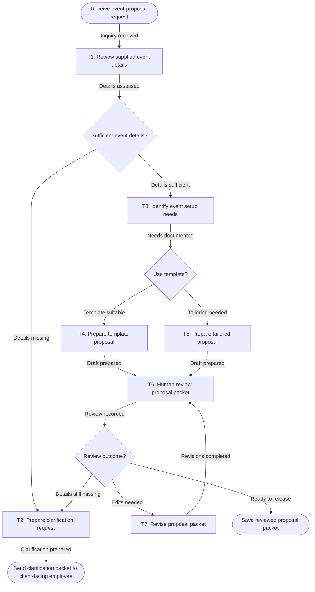

# Workflow of Tasks

## 1. Workflow Goal

This workflow supports the goal in our completed [team charter]([Complete this field]). The workflow coordinates Review supplied event details, Identify event setup needs, Prepare template proposal, Human-review proposal packet, Revise proposal packet, Prepare clarification request, Prepare tailored proposal. Its intended result is: A proposal packet and recorded acceptable review outcome are available as evidence that this workflow run completed.

## 2. Workflow Trigger

A supplied client event inquiry and any accompanying event details begin one workflow run.

## 3. Completion Condition at Runtime

A proposal packet and recorded acceptable review outcome are available as evidence that this workflow run completed.

## 4. General Workflow

The workflow starts when A supplied client event inquiry and any accompanying event details begin one workflow run..

T1 · Review supplied event details: Examine the supplied event information for guest count, event type, date, time, and other details needed to prepare a proposal. T3 · Identify event setup needs: Document the indicated chairs, tables, AV equipment, event-space needs, and unresolved setup questions from the supplied details. T4 · Prepare template proposal: Prepare a proposal using an available template and the documented event setup needs. T6 · Human-review proposal packet: Review proposal completeness and consistency with the supplied details; flag unresolved details and personal-information retention concerns, then record the review outcome. T7 · Revise proposal packet: Address review comments using the supplied event details and return the revised packet for human review. T2 · Prepare clarification request: List the missing event details and prepare a focused clarification request for follow-up. T5 · Prepare tailored proposal: Prepare a tailored proposal when a template is not suitable for the documented event setup needs.

Task connections: START → T1 (Inquiry received); T1 → D1 (Details assessed); T2 → HANDOFF (Clarification prepared); T3 → D2 (Needs documented); T4 → T6 (Draft prepared); T5 → T6 (Draft prepared); T6 → D3 (Review recorded); T7 → T6 (Revisions completed).

Routing: Sufficient event details? — Details sufficient → T3 · Identify event setup needs; Details missing → T2 · Prepare clarification request. Use template? — Template suitable → T4 · Prepare template proposal; Tailoring needed → T5 · Prepare tailored proposal. Review outcome? — Ready to release → END · Save reviewed proposal packet; Edits needed → T7 · Revise proposal packet; Details still missing → T2 · Prepare clarification request.

T6 · Human-review proposal packet is performed by Proposed reviewer. The human reviewer receives the completed proposal packet, source event details, and setup-needs assessment from T4 or T5. Within 10 minutes of receipt, they manually compare the packet with the source information and team criteria, then record the review outcome and supporting evidence directly in the proposal packet or generated Markdown as Ready for release, Needs revision, or Needs clarification. The reviewer hands the recorded outcome to D3 · Review outcome. Packets needing edits go to T7, and packets missing essential details go to T2.

Stopped cases: Work stops with a packet listing missing event details and the clarification request sent to the proposed client-facing employee..

Exception and handoff instructions: T1: T2 - Prepare clarification request T1: Record the status and evidence without retaining client personal information, then notify the task owner and route the request to T3, “Identify event setup needs,” or T2, “Prepare clarification request.” T3: Route the request to T2 Prepare clarification request and notify the task owner/event coordinator. T3: On timeout, exhausted retries, or an error that cannot be retried: Record the status and supporting evidence without retaining client personal information, notify the task owner/event coordinator, and route the request to T2 or T4 as appropriate. T4: Route the request to T2 ,Prepare clarification request and notify the task owner. T4: Record the status and supporting evidence without retaining client personal information, notify the task owner/event coordinator, and route the item to D2 or T5 as appropriate. T6: Notify the task owner and route the item to T7 · Revise proposal packet or T2 · Prepare clarification request. T7: Required source information is missing, sources conflict, the agent cannot make progress, the inference limit or timeout is reached, or a finding affects client commitments, pricing, space, equipment, timing, or release readiness. T7: Designated human proposal reviewer/event coordinator or client-facing employee. Route missing-information issues to T2 · Prepare clarification request. T2: Record the issue and notify the task owner/event coordinator. T2: Record the blocked status and supporting evidence, notify the task owner/event coordinator, and hand off the exception to the client-facing employee or responsible clarification queue. T5: Route the request to T2 · Prepare clarification request and notify the task owner. T5: Record the status and supporting evidence without retaining client personal information, notify the task owner/event coordinator, and route the item to T2 or T6 as appropriate.

## 5. Workflow Diagram

